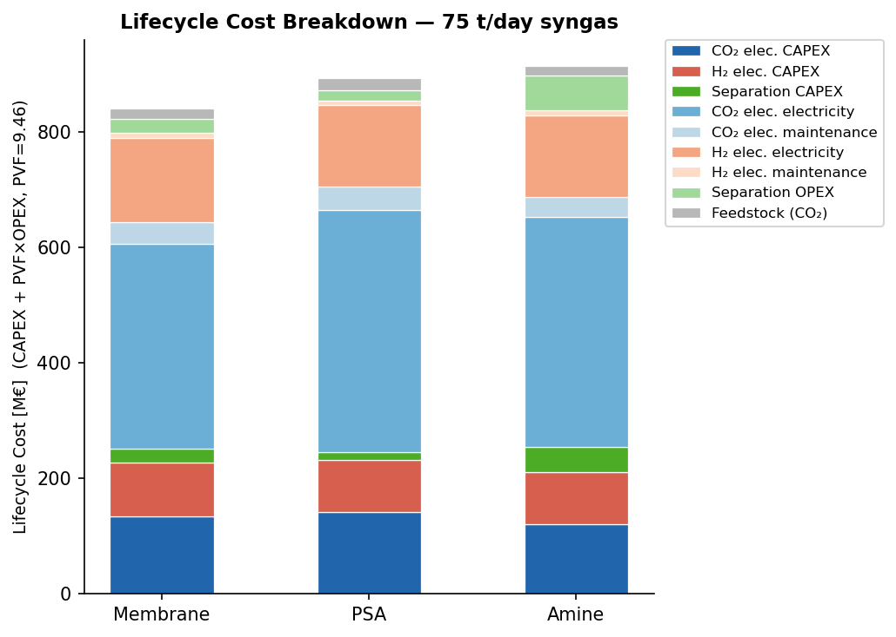
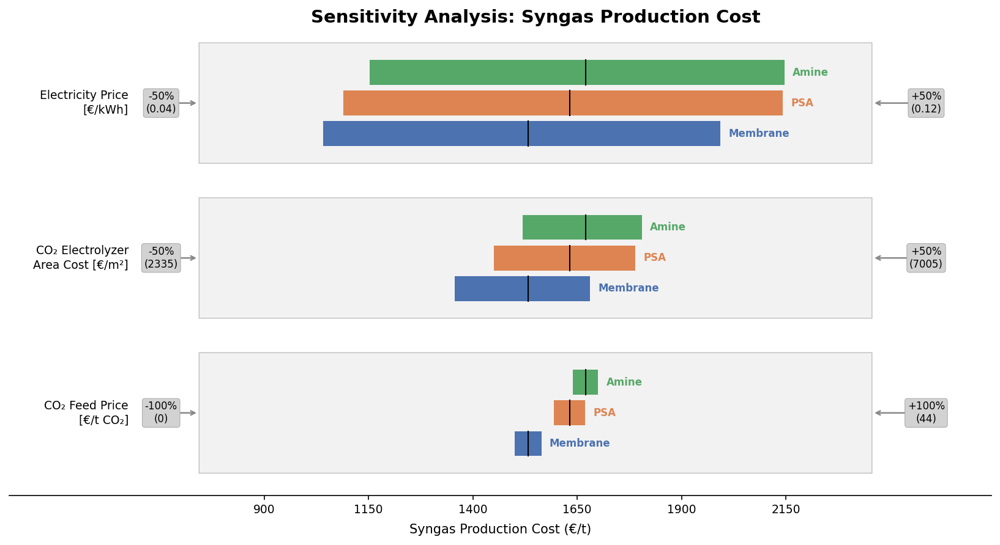

# CO₂-to-Syngas: Process Modelling & Techno-Economic Optimisation

[](LICENSE)


Master's thesis code: *Techno-Economic Optimization of CO₂ Electrolysis and
Separation Systems for Syngas Production*. Philippe Orlewski, M.Sc.
Computational Engineering Science, RWTH Aachen University (AVT.SVT), 2026.
Thesis grade 1.1.

**What it does:** syngas (H₂ + CO, H₂/CO = 2, 75 t/day) is produced from a
**CO₂ electrolyzer** coupled with one of three downstream CO₂/CO separation
technologies. Each combination is built as a closed-loop flowsheet
(electrolyzer + separation + CO₂/CO recycle) in **Pyomo**. Each flowsheet is
solved as one nonlinear optimisation problem that minimises total lifecycle
cost (CAPEX + OPEX) with IPOPT. The flowsheets are then compared and
stress-tested with a sensitivity analysis.

- **Amine wash** (MEA chemical absorption)
- **PSA** (pressure swing adsorption, virtual moving bed abstraction)
- **Gas permeation membrane** (discretised solution-diffusion model, optional multi-stage compression)

The electrolyzer enters the optimisation as a **fast surrogate**: the mechanistic
M3 full channel model of [Bagemihl et al. (2023)](https://doi.org/10.1021/acssuschemeng.3c02226)
(MATLAB) is sampled with Latin-hypercube designs. Symbolic
regression (PySR) and Gaussian-process surrogates are fitted to those samples
and embedded in the Pyomo flowsheets.

## Key results (base case)

| Flowsheet | Lifecycle cost [M€] | Syngas production cost [€/t] |
|-----------|--------------------:|-----------------------------:|
| **Membrane** | **840** | **≈ 1,530** |
| PSA | 893 | ≈ 1,630 |
| Amine wash | 914 | ≈ 1,670 |

These numbers come from the parameter set in `Python/configuration.py`
(electricity 0.08 €/kWh, CO₂ feed 22 €/t, CO₂ electrolyzer 4,670 €/m²).

- The **membrane** flowsheet is cheapest in the base case. It stays cheapest
  across every sensitivity sweep run: electricity price ±50 %, electrolyzer
  area cost ±50 %, CO₂ feed price 0–44 €/t.
- **Electricity dominates** the cost. CO₂-electrolyzer power alone is the
  largest single lifecycle cost item in all three flowsheets. Varying the
  electricity price by ±50 % moves the production cost by roughly
  ±30 %, far more than any other parameter.
- The amine wash has the lowest electrolyzer CAPEX, but the highest
  separation CAPEX and OPEX.

<p align="center">
  
  
</p>

The full written thesis is included: [`2026_MA_thesis_Orlewsk_signed.pdf`](2026_MA_thesis_Orlewsk_signed.pdf).

## Methods & tools

Python · Pyomo · IPOPT (via IDAES) · multistart NLP · PySR symbolic regression ·
Gaussian processes · scikit-learn · MATLAB (`bvp4c`, method of lines) ·
Latin-hypercube sampling · pytest

## Two parts

- **`Matlab/`**: the mechanistic 2D channel electrolyzer model (M3, by
  Bagemihl et al. 2023, see [Credits](#credits)) that generates the electrolyzer training data.
- **`Python/`**: fits a fast surrogate to that data and runs the Pyomo
  techno-economic flowsheet optimisation and sensitivity analysis.

Data flow: `Matlab/` samples the mechanistic model → CSV datasets →
`Python/SurrogateModeling/` fits the surrogate → `Python/SubModels/` and the
flowsheets consume it.

---

## Requirements

- **Python 3.11** (conda environment `Masterarbescht`)
- [Pyomo](https://pyomo.org/) with the **IPOPT** solver — installed here via
  `idaes-pse` (`idaes get-extensions` provides the IPOPT binaries)
- Scientific stack: `numpy`, `scipy`, `pandas`, `scikit-learn`, `sympy`, `Pint`
- Plotting/reporting: `matplotlib`, `seaborn`, `prettytable`, `openpyxl`
- `pysr` for symbolic regression (only for `Python/SurrogateModeling/`)
- **MATLAB** (only for the `Matlab/` data-generation model; uses `bvp4c`)

Install the Python side from the pinned `requirements.txt`:

```bash
conda create -n Masterarbescht python=3.11
conda activate Masterarbescht
pip install -r Python/requirements.txt
idaes get-extensions        # installs the IPOPT solver binaries
```

The Python models import `configuration.py` from `Python/`, so scripts add that
directory to `sys.path` — run them from within the `Python/` directory.

---

## Repository structure

```
co2-to-syngas-techno-economic-optimization/
├── README.md                        # This file
├── 2026_MA_thesis_Orlewsk_signed.pdf   # Full written thesis
├── .gitignore
│
├── Matlab/                          # Mechanistic electrolyzer model + training-data generation
│   ├── channelmodel_full_Ag_Python.m   # Full 2D channel model (M3, Bagemihl) — CO/CO2 electrolysis
│   ├── M3_CO_wrapper.m                 # Wrapper: runs M3 for a given E_appl & inlet composition
│   ├── Data.m                          # Physical parameters / constants for the channel model
│   ├── DataGen.m                       # LHS / random sampling loop → training-data CSVs
│   ├── SensitivityAnalysis.m           # Sensitivity sweeps of the mechanistic model
│   ├── SensitivityH2.m, test_model.m   # H2-share sensitivity / single-point test run
│   ├── LHS_data/, RandomData/          # Sampled datasets (feed the Python surrogate)
│   └── SensitivityData_*/              # Sensitivity outputs used for plotting
│
└── Python/                          # Techno-economic optimisation (Pyomo)
    ├── requirements.txt                # Pinned dependencies (conda env "Masterarbescht")
    ├── configuration.py                # Central config: all model parameters & variable bounds
    ├── target.txt                      # Syngas production target notes (75 t/day)
    │
    ├── SubModels/                      # Unit-operation models + full flowsheets
    │   ├── CO2_ElectrolyzerSurrogateModel.py   # CO2 electrolyzer surrogate (shared front-end)
    │   ├── H2_Electrolyzer_Model.py            # Standalone PEM/alkaline H2 electrolyzer
    │   ├── AmineWash.py                        # MEA amine-wash cost-correlation model
    │   ├── PSAModel.py                         # PSA virtual-moving-bed model
    │   ├── GasPermeationMembraneModel.py       # Discretized membrane (solution-diffusion)
    │   ├── solver_utils.py                     # Shared IPOPT solve + multistart backend
    │   ├── AmineWashFlowsheet.py               # Electrolyzer + amine wash + recycle
    │   ├── PSAFlowsheet.py                     # Electrolyzer + PSA + recycle
    │   ├── MembraneFlowsheet.py                # Electrolyzer + compression + membrane + recycle
    │   ├── CompressionFlash/                   # Compression-train sub-units
    │   │   ├── Compressor.py, HeatEXModel.py, FlashModel.py, MixtureCp.py
    │   │   └── MultiStageCompressionFlowsheet.py
    │   └── AmineWashModel.pdf                  # Reference derivation for the amine model
    │
    ├── SurrogateModeling/              # Building the electrolyzer surrogate correlations
    │   └── CO2Electrolysis/
    │       ├── prepare_training_data.py        # Training-data assembly (from Matlab CSVs)
    │       ├── symbolicregression*.py          # PySR symbolic regression runs
    │       ├── GaussianProcess.py              # GP alternative
    │       ├── DatasetPlotting.py              # Dataset / fit visualisation
    │       ├── SR_runs/                        # Symbolic-regression run outputs (per output var)
    │       └── Plots/                          # Generated figures
    │
    ├── SensitivityAnalysisAndPlotting/ # Post-processing, comparison & sweeps
    │   ├── FullFlowsheets/
    │   │   ├── Scripts/
    │   │   │   ├── compare_flowsheets.py       # Run all 3 flowsheets, compare side-by-side
    │   │   │   ├── sensitivity_sweep.py        # Sweep one Economics parameter
    │   │   │   └── plot_sensitivity_tornado.py # Tornado plots
    │   │   └── Plots/                          # Comparison & sensitivity figures
    │   └── PSA/
    │       ├── Scripts/test_sweep_pH.py        # PSA-specific pressure sweep
    │       ├── Data/  └── Plots/
    │
    ├── unit_tests/                     # Pytest suite (see unit_tests/README.txt)
    │   ├── test_*.py                           # One test module per unit/flowsheet
    │   └── README.txt                          # Convergence tips & debugging advice
    │
    └── graveyard/                      # Deprecated / archived earlier model versions
```

---

## Core concepts

### Mechanistic electrolyzer model (`Matlab/`)
The upstream, physics-based CO₂/CO channel electrolyzer model (M3, by
Bagemihl et al. 2023, see [Credits](#credits)): `channelmodel_full_Ag_Python.m` solves the coupled 2D
concentration field (method of lines) and catalyst-layer BVP (`bvp4c`) to
return conversion, Faradaic efficiency, current density and pressure drop for a
given applied potential and inlet composition. `M3_CO_wrapper.m` wraps a single
run; `DataGen.m` sweeps it over Latin-hypercube / random samples to build the
training-data CSVs (`LHS_data/`, `RandomData/`) that the Python surrogate is
fitted to. `SensitivityAnalysis.m` / `SensitivityH2.m` probe the mechanistic
model directly. This part requires MATLAB and is independent of the Python
optimisation stack.

### `configuration.py`
The single source of truth. All physical constants, economic parameters
(electricity price, CO₂ feed price, interest rate, plant life), and each
model's parameters and variable bounds live here as `@dataclass` blocks
(e.g. `Constants`, `Economics`, `ElectrolyzerParametersSurrogate`,
`PSAParameters`, `AmineWashParameters`, `AbsorberSurrogateParameters`).
The unit models read these dataclasses when building their Pyomo `Param`s and
`Var`s, so most experiments are driven by editing values here.

### Sub-models (`SubModels/`)
Each unit operation is a `pyo.ConcreteModel` subclass with
`build_parameters()`, `build_variables()`, and `build_constraints()`. The
**CO₂ electrolyzer surrogate** is the shared front-end fed into all three
flowsheets. Key references are documented in each file's header (Kim & Léonard
2025 for amine, Sees et al. 2021 / Tjahjana 2025 for PSA, Heßelmann et al. 2023
for the membrane).

### Flowsheets
`AmineWashFlowsheet.py`, `PSAFlowsheet.py`, and `MembraneFlowsheet.py` each
wire the electrolyzer to a separation unit and close the CO₂/CO recycle loop,
then minimise `total_lifecycle_cost`. Each file's docstring contains an ASCII
process-topology diagram and the recycle mole balance. All three solve through
`solver_utils.py`, which provides a consistent IPOPT setup plus a hand-rolled
multistart ("pseudo-global") search.

### Analysis
`compare_flowsheets.py` runs all three flowsheets at a common syngas target and
emits comparison tables and bar charts. `sensitivity_sweep.py` patches a single
`Economics` parameter across a range and regenerates the full report per value;
`plot_sensitivity_tornado.py` produces tornado plots.

---

## Typical workflows

All commands below are run from the `Python/` directory (`cd Python` first).

**Run the test suite** (validates each unit and flowsheet converges):
```bash
pytest unit_tests
```
(Some tests may no longer converge at their stored operating points; they have not been re-run recently.)

**Compare the three flowsheets:**
```bash
python SensitivityAnalysisAndPlotting/FullFlowsheets/Scripts/compare_flowsheets.py
```
Edit the constants at the top of the script (syngas target, H₂ sourcing,
homotopy steps) to change the run. Figures land in `../Plots/`.

**Sweep an economic parameter:**
```bash
python SensitivityAnalysisAndPlotting/FullFlowsheets/Scripts/sensitivity_sweep.py
```
Configure the `SWEEP` block at the top; results land in
`../Plots/sensitivity_<param>/<value>/`.

---

## Notes & gotchas

- These flowsheets are stiff.
  `unit_tests/README.txt` collects hard-won convergence advice (fix all degrees
  of freedom first, converge units separately before connecting, watch which
  bounds are hit, gradually free variables, then move to optimisation).
- The amine-wash surrogate is validated for **5–50 mol% CO₂** and a
  **~75 t/day** syngas scale — see `target.txt`.
- `graveyard/` holds superseded model versions kept for reference; it is not
  part of the active pipeline.
- `__pycache__/`, `.pytest_cache/`, and generated `Plots/` folders are build
  artefacts, not source.

---

## Credits

The CO₂ electrolyzer modelling in this work builds directly on the work of
**Isabell Bagemihl** (TU Delft):

- The mechanistic **M3 full channel model** (`Matlab/channelmodel_full_Ag_Python.m`,
  including `FLC_CL_BL`) and the cell-voltage equations used in the surrogate are
  from Bagemihl et al., who also provide its CO₂-to-CO specification. In this work the
  model is wrapped for surrogate training-data generation.
  > I. Bagemihl, L. Cammann, M. Pérez-Fortes, V. van Steijn, J. R. van Ommen.
  > *Techno-economic Assessment of CO₂ Electrolysis: How Interdependencies between
  > Model Variables Propagate Across Different Modeling Scales.*
  > ACS Sustainable Chemistry & Engineering 11(27), 10130–10141 (2023).
  > [doi:10.1021/acssuschemeng.3c02226](https://doi.org/10.1021/acssuschemeng.3c02226)
- Voltage calculations and electrolyzer cost data are adapted from her PhD thesis:
  > I. Bagemihl. *Insights from operating under gas-liquid Taylor flow and
  > techno-economic optimisation: Reactor design and economics of CO₂ electrolysers.*
  > PhD thesis, Delft University of Technology (2024).
  > [doi:10.4233/uuid:3bc3bb7e-03f4-4941-90b0-57747b14e5e8](https://doi.org/10.4233/uuid:3bc3bb7e-03f4-4941-90b0-57747b14e5e8)

References for the separation models (Kim & Léonard 2025, Sees et al. 2021,
Tjahjana 2025, Heßelmann et al. 2023) are given in each model file's header and
in the thesis.

## License

MIT for my own code (see [`LICENSE`](LICENSE)). The M3 channel model in
`Matlab/channelmodel_full_Ag_Python.m` is the work of Bagemihl et al. (see
[Credits](#credits)); all rights to it remain with its original authors.
